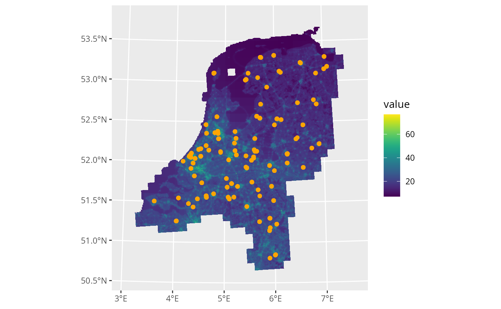
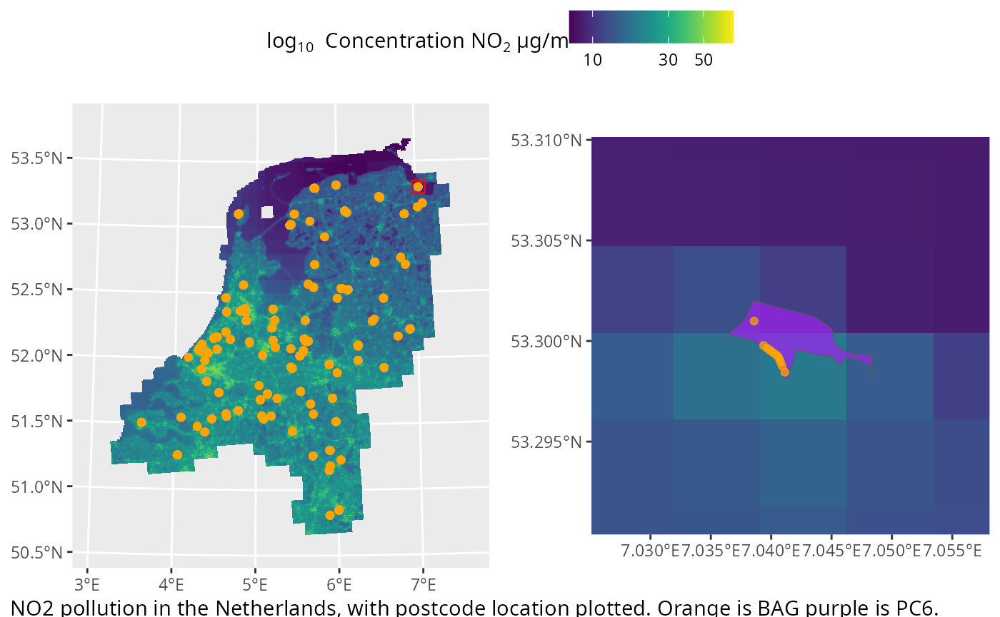

# Spacial plotting

Within this article the methods to plot the underlying spacial data
postcodElapse works with will be explored. For this some preparation is
required, we recommend installing the
[tidyverse](https://tidyverse.org/),
[tidyterra](https://dieghernan.github.io/tidyterra/articles/tidyterra.html)
and [ggpubr](https://rpkgs.datanovia.com/ggpubr/) R-packages. These work
together to enable spacial plotting in R.

## ELAPSE

To understand the spacial relation of postcodes some map is required,
the best equivalent postcodElapse provides is ELAPSE. See the block
below to load and plot ELAPSE.

``` r

library(tidyverse)
library(tidyterra)
library(postcodElapse)

elapse <- loadElapse()

ggplot() +
  geom_spatraster(data = elapse) +
  facet_wrap(~ lyr)
#> <SpatRaster> resampled to 500490 cells.
```


When plotting we recommend passing the data directly to an geom via the
*data* argument, this makes layering multiple datasets into one figure
easy. The concentration retrieved from ELAPSE are mapped to the fill
aestetic, to change the colour scheme we recommend
`?tidyterra::scale_fill_grass_c()`. When no facet is used a single panel
will be plotted containing mean pollutant concentrations. Subset ELAPSE
with the `$` operator to plot a single layer.

## Accessing postcode geo-locations

To plot the location of postcodes on ELAPSE the geo-location is
*required* these are provided trough:
[`pollutionFromBag()`](https://griac-bioinformatics.github.io/postcodElapse/reference/pollutionFromBag.md)
and
[`pollutionFromPc6()`](https://griac-bioinformatics.github.io/postcodElapse/reference/pollutionFromPc6.md).
These function output spacial data in the `geom` column. Plotting this
data can be done with
[`geom_sf()`](https://ggplot2.tidyverse.org/reference/ggsf.html), see
the block below.

``` r

path <- system.file("extdata/postcode100.rds", package = "postcodElapse")
postcode100 <- readRDS(path)

pc6 <- pollutionFromPc6(postcode100, "../../../data/cbs_pc6_2024.gpkg")
#> Guessed db type to be: PC6
bag <- pollutionFromBag(postcode100, "../../../data/bag-light.gpkg")
#> Guessed db type to be: BAG

ggplot() +
  geom_spatraster(data = elapse$NO2FULL) + 
  geom_sf(data = pc6, aes(geometry = geom), fill = "purple", alpha = 0.7) +
  geom_sf(data = bag, aes(geometry = geom), colour = "orange") +
  scale_fill_grass_c()
#> <SpatRaster> resampled to 500490 cells.
```



## Zooming and insetting

Due to the scale of ELAPSE it may be hard to visualize the data. To
alleviate this we recommend creating an inset plot and marking the
location of the zoom on the main plot. postcodElapse provides
[`geom_rectFeature()`](https://griac-bioinformatics.github.io/postcodElapse/reference/geom_rectFeature.md)
and
[`coord_zoomFeature()`](https://griac-bioinformatics.github.io/postcodElapse/reference/coord_zoomFeature.md)
to annotate and zoom into specific spatial features. Below is an example
showing how to use these helpers with ggpubr to build an inset.

``` r

library(ggpubr) #used to arrange plots into one figure.

main <- ggplot() +
  geom_spatraster(data = elapse$NO2FULL) + 
  geom_sf(data = pc6, aes(geometry = geom), fill = "purple", alpha = 0.7) +
  geom_sf(data = bag, aes(geometry = geom), colour = "orange", alpha = 0.7) +
  scale_fill_grass_c(transform = "log10") +
  geom_rectFeature(pc6[100, ], 5000) + # Mark the location of interest
  labs(fill = bquote("log"[10]~" Concentration NO"[2]~"µg/m"^3)) +
  theme(legend.position = "top")
#> <SpatRaster> resampled to 500490 cells.

inset <- ggplot() +
  geom_spatraster(data = elapse$NO2FULL) + 
  geom_sf(data = pc6, aes(geometry = geom), fill = "purple", alpha = 0.7) +
  geom_sf(data = bag, aes(geometry = geom), colour = "orange", alpha = 0.7) +
  scale_fill_grass_c(transform = "log10") +
  coord_zoomFeature(pc6[100, ]) # Zoom into the location of interest
#> <SpatRaster> resampled to 500490 cells.

# Make and annotate the combined figure.
fig <- ggarrange(main, inset, ncol = 2,
                 common.legend = TRUE,
                 legend.grob = get_legend(main))

annotate_figure(fig, 
                fig.lab.pos = "bottom.left",
                fig.lab = "NO2 pollution in the Netherlands, with postcode location plotted. Orange is BAG purple is PC6.")
```



When using `geom_rectFeatrue()` and
[`coord_zoomFeature()`](https://griac-bioinformatics.github.io/postcodElapse/reference/coord_zoomFeature.md)
ensure you subset entire rows using `[12, ]`. Additionally air pollution
estimate are always returned in alpha numeric order.

With this material you can plot the spacial data of postcodes and
ELAPSE. To see all plotting options we recommend the documentation of
[ggplot](https://ggplot2.tidyverse.org/),
[tidyterra](https://dieghernan.github.io/tidyterra/articles/tidyterra.html)
and [ggpubr](https://rpkgs.datanovia.com/ggpubr/index.html_)
