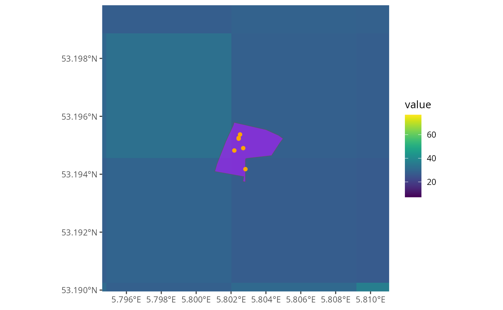

# Spacial plotting

## :construction: UNDER CONSTRUCTION :construction:

This article is incomplete!

### Spacial plotting

The data postcodElapse handles inherently has an spacial component so
plotting the data is of interest in some cases. There is one problem
tough base R plotting doesn’t handle spacial data well. I recommend you
install the `tidyverse` and `tidyterra` packages, this equips us with
ggplot2 and tidyterra enhances ggplot2 with spacial plotting.

#### ELAPSE

Remember I said ELAPSE models air pollution concentration across Europe,
well lets plot the internal one and took at the structure. Small
side-note when working ELAPSE I recommend unloading by running
`rm(elapse)` before saving you environment. The way ELAPSE is stored by
R it will lead to errors when you re-load it from a fresh R session.

Now lets get plotting, the block below loads packages, then ELAPSE
subsequently plotting it.

``` r

# Remember to install these!
library(tidyverse)
library(tidyterra)
library(postcodElapse)

elapse <- loadElapse()

ggplot() +
  geom_spatraster(data = elapse) +
  facet_wrap(~ lyr)
#> <SpatRaster> resampled to 500490 cells.
```


We can see the shape of the Netherlands well, if you want to change the
fill colour I recommend reading the docs of
[`?tidyterra::scale_fill_grass_c`](https://dieghernan.github.io/tidyterra/reference/scale_grass.html).
Before we plot the location of postcodes on top of ELAPSE, I am going to
explain the `pollutionFrom*()` functions.

#### PollutionFrom\*()

The `pollutionFrom*()` functions do the estimating of air-quality for
postcodes, they are of course specific to BAG or PC6. More importantly
they output spacial data,
[`postcodElapse()`](https://griac-bioinformatics.github.io/postcodElapse/reference/postcodElapse.md)
removes that. First lets look at the spacial data from PC6.

``` r

pollutionFromPc6("9713AV", "../../../data/cbs_pc6_2024.gpkg")
#> Guessed db type to be: PC6
#> Simple feature collection with 1 feature and 20 fields
#> Geometry type: MULTIPOLYGON
#> Dimension:     XY
#> Bounding box:  xmin: 234015.1 ymin: 582553.7 xmax: 234196 ymax: 582720.1
#> Projected CRS: Amersfoort / RD New
#>   postcode  n BCFULL_avg NO2FULL_avg O3FULLa_avg O3FULLc_avg O3FULLw_avg
#> 1   9713AV NA    1.87643     31.3348    59.92856    44.74765    77.72683
#>   PM25FULLt_avg BCFULL_min NO2FULL_min O3FULLa_min O3FULLc_min O3FULLw_min
#> 1      15.53723   1.874042    31.10718     59.8123    44.69811     77.5975
#>   PM25FULLt_min BCFULL_max NO2FULL_max O3FULLa_max O3FULLc_max O3FULLw_max
#> 1       15.4238   1.878818    31.56242    60.04483     44.7972    77.85616
#>   PM25FULLt_max                           geom
#> 1      15.65066 MULTIPOLYGON (((234060.7 58...
```

As you see it looks like the output from
[`postcodElapse()`](https://griac-bioinformatics.github.io/postcodElapse/reference/postcodElapse.md)
but it has extra data. All the `Simple features collecto...` stuff is
metadata describing the coordinate system, you don’t have to worry about
this unless you need to modify it. In the data itself the extra column
**geom** exists, it contains the physical area of an postcode. Now lets
look at BAG

``` r

data <- pollutionFromBag("9714AV", "../../../data/bag-light.gpkg")
#> Guessed db type to be: BAG

head(data, 4)
#>   ID   BCFULL  NO2FULL  O3FULLa  O3FULLc  O3FULLw PM25FULLt postcode
#> 1  1 1.780593 29.27458 61.25306 45.00510 78.46283  14.91388   9714AV
#> 2  2 1.780593 29.27458 61.25306 45.00510 78.46283  14.91388   9714AV
#> 3  3 1.780593 29.27458 61.25306 45.00510 78.46283  14.91388   9714AV
#> 4  4 1.793867 29.55525 61.25234 45.05892 78.62730  15.18978   9714AV
#>                        geom
#> 1   POINT (233671 582898.5)
#> 2 POINT (233667.3 582905.1)
#> 3   POINT (233680 582881.2)
#> 4 POINT (233657.3 582919.4)
```

BAG has way less columns than PC6 that is due to bag containing points.
It is not practical to convert points to areas. So I built
[`pollutionFromBag()`](https://griac-bioinformatics.github.io/postcodElapse/reference/pollutionFromBag.md)
to output the raw data collected from BAG and ELAPSE. It does provide
a-lot more rows one per building in a postcodes for all postcodes. The
geom column contains effectively the geo-graphic position of a building.

### Plotting

Now we understand the `pollutionFrom*()` functions we do some spacial
plotting with layers. I have selected some postcodes form public
locations across the Netherlands and we are going to plot then on the
NO₂ layer of ELAPSE.

``` r

postcodes <- c("9714AV", "1071XX", "8934CJ", "1789AX")

elapse <- loadElapse()

pc6 <- pollutionFromPc6(postcodes, "../../../data/cbs_pc6_2024.gpkg")
#> Guessed db type to be: PC6
bag <- pollutionFromBag(postcodes, "../../../data/bag-light.gpkg")
#> Guessed db type to be: BAG

ggplot() +
  geom_spatraster(data = elapse$NO2FULL) + # index to a specific layer with '$'
  geom_sf(data = pc6, aes(geometry = geom), fill = "purple", alpha = 0.7) +
  geom_sf(data = bag, aes(geometry = geom), colour = "orange") +
  scale_fill_grass_c()
#> <SpatRaster> resampled to 500490 cells.
```


#### Zooming

Oke we can see ELAPSE and see orange points, where are the purple areas?
And shouldn’t there be many points? They are both in the plot just very
small and fighting over the same space. A note postcodes are always
returned sorted in alpha numeric fastion, check the data first.

``` r

postcodes <- c("9714AV", "1071XX", "8934CJ", "1789AX")

elapse <- loadElapse()

pc6 <- pollutionFromPc6(postcodes, "../../../data/cbs_pc6_2024.gpkg")
#> Guessed db type to be: PC6
bag <- pollutionFromBag(postcodes, "../../../data/bag-light.gpkg")
#> Guessed db type to be: BAG

ggplot() +
  geom_spatraster(data = elapse$NO2FULL) +
  geom_sf(data = pc6, aes(geometry = geom), fill = "purple", alpha = 0.7) +
  geom_sf(data = bag, aes(geometry = geom), colour = "orange") +
  coord_zoomFeature(pc6[3, ], 1000) + # Very important to index using [3, ]!
  scale_fill_grass_c()
#> <SpatRaster> resampled to 500490 cells.
```



Now we have zoomed, another important note. `coord_zoomFreature()` and
it’s counterpart
[`geom_rectFeature()`](https://griac-bioinformatics.github.io/postcodElapse/reference/geom_rectFeature.md)
expect the **entire row** from the `pollutionForm*()` functions. So a
trailing comma **must** be used when you are indexing. (i.e. `pc6[1, ]`)

### Insetting

Oke when zooming you might want to show the un-zoomed plot to give
context. But when multiple location are plotted it is hard to identify
the relevent one.
[`coord_zoomFeature()`](https://griac-bioinformatics.github.io/postcodElapse/reference/coord_zoomFeature.md)
add a rectangle to you plot centered at the given spacial data.
Toghether with a package like ggpubr you can plot pretty looking insets!

``` r

library(ggpubr)

postcodes <- c("9714AV", "1071XX", "8934CJ", "1789AX")

elapse <- loadElapse()

pc6 <- pollutionFromPc6(postcodes, "../../../data/cbs_pc6_2024.gpkg")
#> Guessed db type to be: PC6
bag <- pollutionFromBag(postcodes, "../../../data/bag-light.gpkg")
#> Guessed db type to be: BAG

# Same as with Zooming just saving it to a var.
inset <- ggplot() +
  geom_spatraster(data = elapse$NO2FULL) +
  geom_sf(data = pc6, aes(geometry = geom), fill = "purple", alpha = 0.7) +
  geom_sf(data = bag, aes(geometry = geom), colour = "orange") +
  coord_zoomFeature(pc6[3, ], 1000) +
  scale_fill_grass_c()
#> <SpatRaster> resampled to 500490 cells.

# Now the overview
main <- ggplot() +
  geom_spatraster(data = elapse$NO2FULL) +
  geom_sf(data = pc6, aes(geometry = geom), fill = "purple", alpha = 0.7) +
  geom_sf(data = bag, aes(geometry = geom), colour = "orange") +
  geom_rectFeature(pc6[3, ], size = 4000) +
  scale_fill_grass_c()
#> <SpatRaster> resampled to 500490 cells.

# Put the two plot together in one figure
ggarrange(main, inset, ncol = 2, common.legend = TRUE)
```


Voila now you can make as many insets as possible. All arguments of
[`geom_rect()`](https://ggplot2.tidyverse.org/reference/geom_tile.html)
apply, so many options are available. When working with multiple insets
I recommend changing the border colour of the corresponding plots.
[`geom_rectFeature()`](https://griac-bioinformatics.github.io/postcodElapse/reference/geom_rectFeature.md)
can also be used to annotate your plots.
