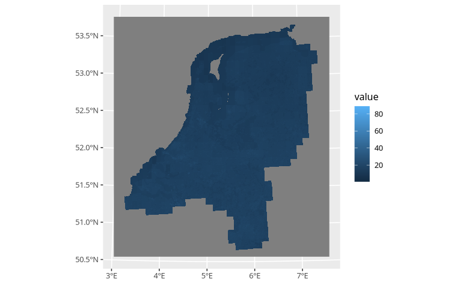
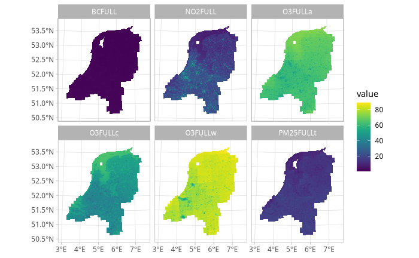

```{r, include = FALSE}
knitr::opts_chunk$set(
  collapse = TRUE,
  comment = "#>"
)
```

The data you manipulating an generating with postcodElapse, is inherently spacial.
Even though that might not seem, `postcodElapse()` strips all spacial data form
its output. For those who want to plot spatially I recommend installing the 
[tidyverse](https://tidyverse.org/) and [tidyterra](https://dieghernan.github.io/tidyterra/)
Packages. Fist I am introducing you to plotting backgrounds, maps or images then
laying the air pollution estimates on top.

## Backgrounds
For plotting spacial data you of course need a background when working with 
postcodElapse most useful is an map. Consequently ELAPSE is an map, just one of 
air pollution for this demo I will be using it. The `loadElapse()` returns a 
spatraster containing ELAPSE, which can be plotted using `ggplot()` with 
`goem_spatraster()`, see below.
``` r
elapse <- loadElapse()

ggplot() +
  geom_spatraster(data = elapse)
#> <SpatRaster> resampled to 500490 cells.
#> ! `tidyterra::geom_spatraster()`: Plotting 6 overlapping layers: BCFULL, 
#>              NO2FULL, O3FULLa, O3FULLc, O3FULLw, and PM25FULLt. Either:
#> 
#> • Use `facet_wrap(~lyr)` to facet layers.
#> • Use `aes(fill = <name_of_layer>)` to display a single layer.
```



`geom_spatraster()` when given no extra options combines all layers into a single 
one. This does not look very interesting so we can do what tidyterra suggests
which is using an facet. In addition I am adding `scale_fill_grass_c()` making the
fill look better, other variants exist check the 
[docs](https://dieghernan.github.io/tidyterra/reference/scale_grass.html). 
If you want to plot an specific layer I use sub-setting i.e. `data = elaspe$NO2FULL`.

``` r
elapse <- loadElapse()

ggplot() +
  geom_spatraster(data = elapse) + # Use subset "$" to plot a specific layer.
  scale_fill_grass_c() +
  facet_wrap(~ lyr)
```



Lots better! Standard ggplot2 rules apply for editing these plots so have fun 
experimenting. 

One important thing when making the plot you can pass the spatraster directly to
the `ggplot()` statement. But this will bite you when you start layering data.
I recommend passing your data directly to the layer with the following statement:  
`geom_spatraster(data = <your data>, <more parameters>)`.

## Layers
Just plotting an maps is not very informational we need to add more layers, I
will be showing how to plot the spacial data postcodElapse uses internaly. For 
that we first have to look at the output of the pollutionFrom*() functions.

## pollutionFromPc6()
Returns almost the exactly the same data as `postcodElapse()`. Except the return
type is a simple features collection, i.e. it has the extra column "geom" 
containing multipolygons. Which are just areas on a map, in addition to metadata 
describing the coordinate system. See below with the UMCG.
``` r
library(postcodElapse)
pollutionFromPc6("9713GZ", "../../data/cbs_pc6_2024.gpkg")
#> Guessed db type to be: PC6
#> Simple feature collection with 1 feature and 20 fields
#> Geometry type: MULTIPOLYGON
#> Dimension:     XY
#> Bounding box:  xmin: 234303.1 ymin: 582188.6 xmax: 234584.6 ymax: 582625.4
#> Projected CRS: Amersfoort / RD New
#>   postcode  n BCFULL_avg NO2FULL_avg O3FULLa_avg O3FULLc_avg O3FULLw_avg
#> 1   9713GZ NA    1.76874    29.60128    61.81072    45.97693    79.03543
#>   PM25FULLt_avg BCFULL_min NO2FULL_min O3FULLa_min O3FULLc_min O3FULLw_min
#> 1      15.18162   1.753165    28.93738     61.4945    45.72406    78.30206
#>   PM25FULLt_min BCFULL_max NO2FULL_max O3FULLa_max O3FULLc_max O3FULLw_max
#> 1      14.93575    1.82462    30.95777    62.07064    46.13897    79.57148
#>   PM25FULLt_max                           geom
#> 1      15.37438 MULTIPOLYGON (((234417.6 58...
```

## pollutionFromBag()
Produces very different data due to BAG containing the position of all buildings 
in the Netherlands. It outputs the pollution estimates for each building in the 
given postcodes. No average, no "n"m in addition to the geom column containing
points describing the location of that building. And again with the UMCG.
``` r
library(postcodElapse)

pollutionFromBag("9713GZ", "../../data/bag-light.gpkg")
```

## plotting
Adding the output of these function to an plot is as simple as adding a `geom_sf()`,
below I plotted the location of UMCG on the NO~2~ layer of ELAPSE.
``` r
library(tidyverse)
library(tidyterra)
library(postcodElapse)

elapse <- loadElapse()

UMCG <- pollutionFromBag("9713GZ" , "../../data/bag-light.gpkg")

ggplot() +
  geom_spatraster(data = elapse$NO2FULL) +
  geom_sf(data = UMCG, aes(geometry = geom), fill = "red") +
  scale_fill_grass_c()
```

But you have to consider the coordinate system when working with the internal
ELAPSE and data generated by postcodElapse your fine. If you plot the data and 
nothing lines up. Ensure you background has an coordinate system off "EPSG:28992",
if they don't mach you need to load the []

## Plotting


